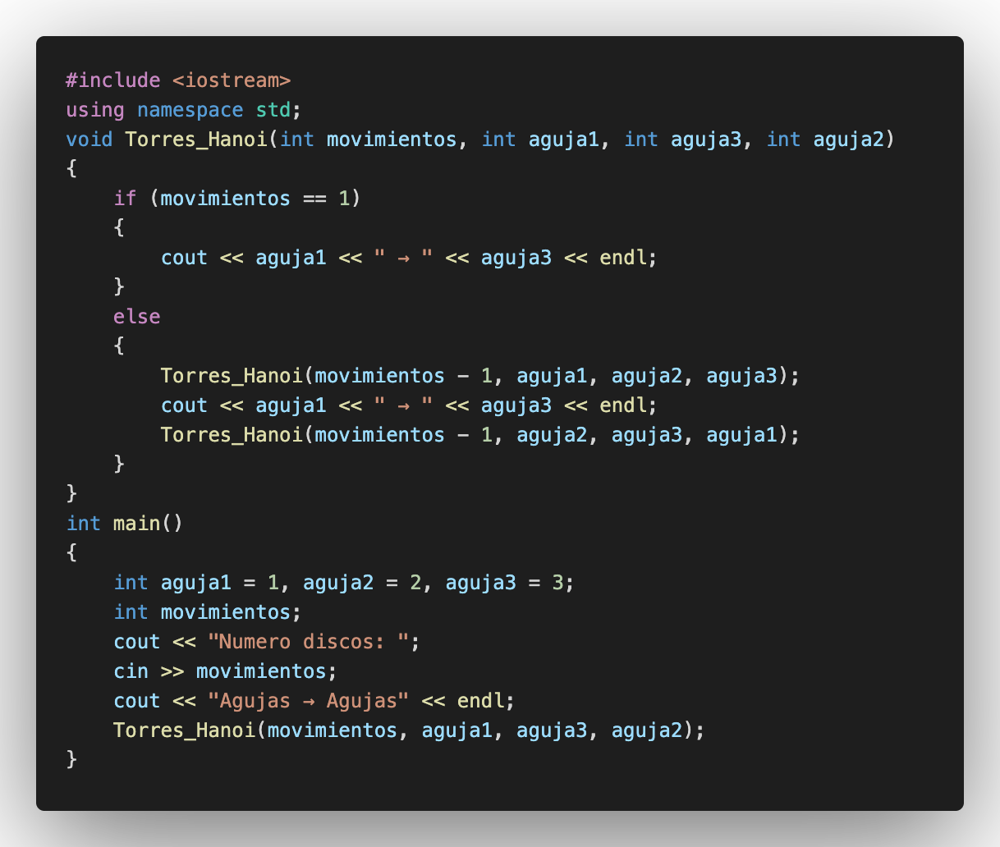
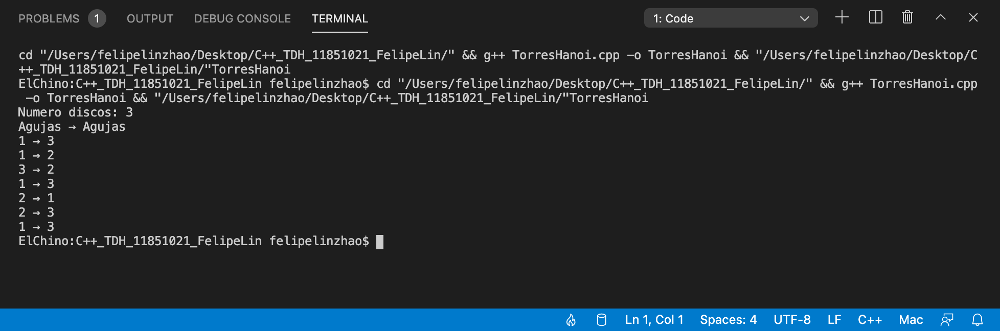

# Punto de control #6

## :copyright: Autor

- :camera: 
- :boy: **Felipe Lin Zhao**
- :e-mail: felipelinchiu321@gmail.com
- :link: [github.com/Perz1vaI](https://github.com/Perz1vaI)
- :calendar: 2020-08-30 18:00 CST

---

## :dart: Objetivos

Completar la tarea que fui asignado a hacer.

---

## :black_circle: static_cast_variable.cpp

---

## :computer: Código

- :blue_book: [Punto de control #6](https://github.com/Perz1vaI/C-_TDH.git)

---
#### Herramientas:
- :package: [Visual Studio Code](https://code.visualstudio.com/)
- :camera: [Polacode-2020 v0.5.2](https://github.com/jeff-hykin/polacode)
- :notebook: [Markdown Cheatsheet](https://github.com/adam-p/markdown-here/wiki/Markdown-Cheatsheet)
- :smile: [Emoji Cheat Sheet](https://www.webfx.com/tools/emoji-cheat-sheet/)